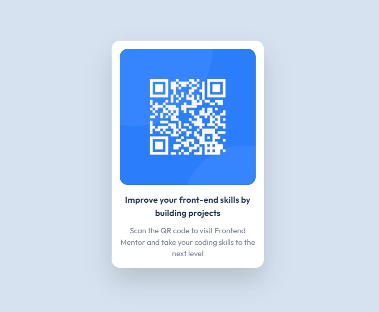

# Frontend Mentor - QR code component solution

This is a solution to the [QR code component challenge on Frontend Mentor](https://www.frontendmentor.io/challenges/qr-code-component-iux_sIO_H). Frontend Mentor challenges help you improve your coding skills by building realistic projects. 

## Table of contents

- [Frontend Mentor - QR code component solution](#frontend-mentor---qr-code-component-solution)
  - [Table of contents](#table-of-contents)
  - [Overviews](#overviews)
    - [Screenshot](#screenshot)
    - [Links](#links)
  - [My process](#my-process)
    - [Built with](#built-with)
  - [Author](#author)

## Overviews

### Screenshot

### Links

- Solution URL: [Solution URL](https://qr-code-component-4fo352h19-alinp25.vercel.app/)

## My process

### Built with

- Mobile-first workflow
- [React](https://reactjs.org/)
- [Next.js](https://nextjs.org/)
- [TailwindCSS](https://tailwindcss.com/)

## Author

- Frontend Mentor - [@alinp25](https://www.frontendmentor.io/profile/alinp25)